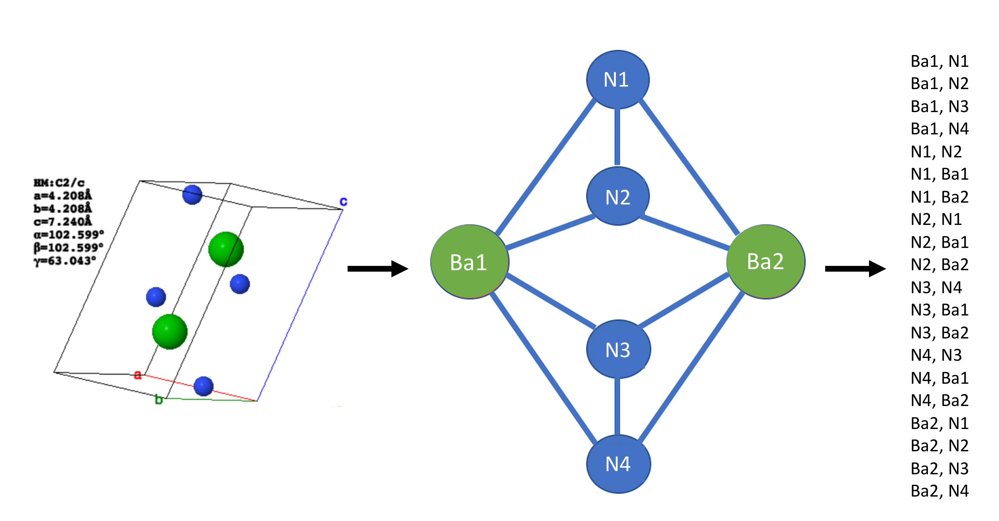

# SkipSpecies

SkipSpecies is a modification to SkipAtom which is an approach for creating distributed representations of atoms, for use in Machine Learning contexts. It is
based on the Skip-gram model used widely in Natural Language Processing. This repository contains the code for training and using SkipAtom/SkipSpecies embeddings, as well as the code for training and evaluating neural network models for materials properties prediction.

## This fork

:warning: For the original SkipAtom repository, see https://github.com/lantunes/skipatom :warning:

Main of the original functions have been kept, but the main changes are:
- The ability to use species instead of atoms
- The ability to use oxidation states in the representations
- The ability to use the oxidation states in the training of the embeddings
- The ability to use the oxidation states in the induction of the embeddings

Data from the parent repository has been removed on this fork, and the data used in the paper has been added.

## Installation

SkipSpecies can be installed with:
```
pip install skipspecies
```
However, this will install a minimal implementation that can be used to work with existing SkipAtom/SkipSpecies embeddings only. To 
train new embeddings, SkipSpecies should be installed with:
```
pip install skipspecies[training]
```

Pre-trained 30-,86-,100-, 200-, 300-, and 400-dimensional SkipAtom and SkipSpecies vectors for 86 atom types/336 species types are available in the `data` directory.

To use the pre-trained vectors, follow the  example in step 4, below.

To create SkipAtom/SkipSpecies vectors, follow steps 1 to 3 below. A dataset of inorganic crystal structures is required. A dataset 
of 110,160 oxidation-state decorated structures obtained from the [Materials Project](https://materialsproject.org/) is available in 
`data/mp_2020_10_09.pkl.gz`.  From this dataset, pairs of co-occurring atoms will be derived, as depicted in the 
schematic below:



These pairs will be used in the training of the SkipAtom/SkipSpecies vectors. Pairs that were previously derived from the 
Materials Project dataset are available in the files:
* Atoms: `data/skipatom_mp2022/mp_2022_10_28.pairs.csv.gz`
* Species: `data/skipatom_mp2022/mp_2022_10_28.pairs_oxi.csv.gz`

_(NOTE: For the following steps 1 to 3, the programs `create_cooccurrence_pairs`, `create_skipatom_training_data` and 
`create_skipatom_embeddings` are installed as console scripts when using `pip install skipspecies`, and will be usable if 
SkipSpecies was installed with `pip install skipspecies[training]`.)_

### Neural Network Models

The `skipatom` module contains Keras-based implementations of an ElemNet-type neural network (for both 
regression and classification). To use these, it is
necessary to have `tensorflow` in the environment. (Have a look at either the `requirements.txt` file or the 
`environment.yml` file for a full list of dependencies.) The neural networks are implemented in the `ElemNet`, 
`ElemNetClassifier` class.

For more information regarding on the `ElemNet` model, see:

[Jha, D., Ward, L., Paul, A., Liao, W. K., Choudhary, A., Wolverton, C., & Agrawal, A. (2018). "ElemNet: Deep Learning 
the Chemistry of Materials From only Elemental Composition." Scientific reports, 8(1), 1-13.](https://www.nature.com/articles/s41598-018-35934-y)


### Reproducing the results from the paper

To run the property prediction tasks described in the paper, follow the steps outlined in the next section.

A Materials Project property dataset can be made for each of the tasks described in the paper using the files in the `data` directory: `data/oxi-mp_property_dataset_unique_formulas.json.gz`. An example of how to create a dataset for the band gap task using the induced, 200-dimensional, sum-pooled SkipSpecies vectors is shown below:

```python
python bin/create_species_property_dataset.py \
--data data/oxi-mp_property_dataset_unique_formulas.json.gz \
--task band_gap \
--pool sum \
--out out_final/species_prop/skipspecies/induced/datasets/skipspecies_sum_dim200_MP_band_gap.pkl \
--species_vectors data/skipspecies_2022_10_28/csv_files/induced/skipspecies_2022_10_28_induced_dim200.csv \
```
The `--task` argument specifies the property to predict, and the `--pool` argument specifies the pooling operation to use. The `--out` argument specifies the location of the resulting dataset file. The `--species_vectors` argument specifies the location of the SkipSpecies vectors to use.

For creating a dataset using the SkipAtom vectors, the `--species_vectors` argument should be replaced with the `--atom_vectors` argument, and the `--species_vectors` argument should be removed.


Once the dataset file is generated, train and evaluate the ElemNet-like model using repeated k-fold cross-validation. From the root of this project:

```python
python bin/train_mlp.py \
--dataset out_final/species_prop/skipspecies/induced/datasets/skipspecies_sum_dim200_MP_band_gap.pkl \
--architecture elemnet \
--results out_final/species_prop/skipspecies/induced/results \
--models out_final/species_prop/skipspecies/induced/models
```

The directories speciefied by the `--results` and `--models` arguments must already exist before `train_mlp.py` is invoked. They will be where the .csv results file and the best models will be placed, respectively. The `train_mlp.py` program also accepts arguments for specifying the number of splits, the batch size, etc.

### Analysing the results from the paper


Jupyter notebooks have been provided in the `notebooks` directory to analyse the results from the paper. A description of the notebooks is provided in the `notebooks/README.md` file.


- - - - - - - - -
## References
The adaptation SkipSpecies is described in the paper _"Ionic species representations for materials informatics"_

>A. Onwuli, K.T. Butler, A. Walsh. Ionic species representations for materials informatics. [in preparation]


The SkipAtom approach, of which this is an adaptation, is described in the paper _"Distributed Representations of Atoms and Materials for Machine Learning"_,

[Antunes, L.M., Grau-Crespo, R. and Butler, K.T., 2022. "Distributed representations of atoms and materials for machine learning". *npj Computational Materials*, **8(1)**, p.44.](https://www.nature.com/articles/s41524-022-00729-3)

This repository includes data from the [Materials Project](https://materialsproject.org/). 

[A. Jain*, S.P. Ong*, G. Hautier, W. Chen, W.D. Richards, S. Dacek, S. Cholia, D. Gunter, D. Skinner, G. Ceder, K.A. 
Persson (*=equal contributions). "The Materials Project: A materials genome approach to accelerating materials innovation".
*APL Materials*, 2013, **1(1)**, 011002.](https://pubs.aip.org/aip/apm/article/1/1/011002/119685/Commentary-The-Materials-Project-A-materials)