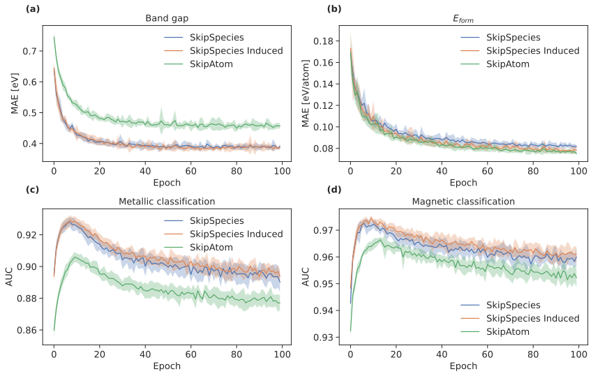

# SkipSpecies

SkipSpecies is a modification to SkipAtom which is an approach for creating distributed representations of atoms, for use in Machine Learning contexts. It is
based on the Skip-gram model used widely in Natural Language Processing. This repository contains the code for training and using SkipAtom/SkipSpecies embeddings, as well as the code for training and evaluating neural network models for materials properties prediction.

This repository supports the findings in our publication "Ionic species representations for materials informatics".

Users can:
* Train their own SkipSpecies vectors using structures from the Materials Project
* Evaluate their atom and/or species-based embeddings on a property dataset obtained from the Materials Project.

## This fork

:warning: For the original SkipAtom repository, see https://github.com/lantunes/skipatom :warning:

Main of the original functions have been kept, but the main changes are:
- The ability to use ionic species in addition to atoms
- The ability to use oxidation states in the representations
- The ability to use the oxidation states in the training of the embeddings
- The ability to use the oxidation states in the induction of the embeddings

Data from the parent repository has been removed on this fork, and the data used in the paper has been added.

## Installation

SkipSpecies can be installed by cloning this repository with:
```bash
git clone https://github.com/WMD-group/skipspecies.git
cd skipspecies
pip install .
```
However, this will install a minimal implementation that can be used to work with existing SkipAtom/SkipSpecies embeddings only. To 
train new embeddings, SkipSpecies should be installed with:
```
pip install .[training]
```

Pre-trained 30-,86-,100-, 200-, 300-, and 400-dimensional SkipAtom and SkipSpecies vectors for 86 atom types/336 species types are available in the `data` directory.

To use the pre-trained vectors, follow the  example in step 4, below.

To create SkipAtom/SkipSpecies vectors, follow steps 1 to 3 below. A dataset of inorganic crystal structures is required. A dataset 
of structures can be obtained from the [Materials Project](https://materialsproject.org/.  From this dataset, pairs of co-occurring atoms will be derived.

These pairs will be used in the training of the SkipAtom/SkipSpecies vectors. 

_(NOTE: For the following steps 1 to 3, the programs `create_cooccurrence_pairs`, `create_skipatom_training_data` and 
`create_skipatom_embeddings` are usable if 
SkipSpecies was installed with `pip install .[training]`.)_

1. Download the structures from the Materials Project:


   ⚠️ The script provided to download the Materials Project data through the oxidation states route of the new API, uses the [`mp-api`](https://pypi.org/project/mp-api/). Due to the different Pymatgen dependencies with using this route, as well as the API undergoing active changes, we recommend that the user makes a separate environment to use this script with the `mp-api`. Once the data is downloaded, the user can switch back to the environment in which they have installed `SkipAtom/SkipSpecies` ⚠️ 

```bash
python bin/download_mp_structs.py \
--apikey APIKEY \
--datapath data \
--oxi_mp
```

_(NOTE: The API KEY must be obtained from the Materials Project site. As well, the `oxi_mp` flag use used to get an oxidation state decorated set of structures)_


2. Create the co-occurrence_pairs

```bash
$ create_cooccurrence_pairs \
--data data/mp_2022_10_28_oxi.pkl.gz \
--out data/mp_2020_10_28.pairs_oxi.csv.gz \
--processes 70 --workers 200 -z
```
_(NOTE: The MP Dataset created in step 1 is automatically versioned. The data path in step 2 should be updated in accordance with the version of the MP dataset that has been download)_

3. Prepare the data for training:

```bash
create_skipatom_training_data \
--data data/mp_2022_10_28.pairs_oxi.csv.gz \
--out data/mp_2022_10_28.species.training.data
```

4. Create the SkipSpecies embeddings:

```bash
create_skipatom_embeddings \
--data data/mp_2022_10_28.species.training.data \
--out data/skipspecies_2022_10_28/mp_2022_10_28.dim200.species.model \
--dim 200 --step 0.01 --epochs 10 --batch 1024
```

5. Load and use the model

```python
from skipatom import SkipSpeciesInducedModel

model = SkipSpeciesInducedModel.load(
    "data/skipspecies_2022_10_28/mp_2022_10_28.dim200.model", 
    "data/mp_2022_10_28.species.training.data", 
    min_count=2e7, top_n=5)

# species vector for O2-
print(model.vectors[model.dictionary["O2-"]])
```

⚠️ Due to file size issues, the following files are currently unavailable:
* `mp_2022_10_28.species.training.data'
* 'mp_2022_10_28.species.pairs.csv.gz'
⚠️

  
The CSV files for the retrained SkipAtom vectors and the SkipSpecies vectors are available in the repository for downstream applications (e.g. training propery prediction models)


### Neural Network Models

The `skipatom` module contains Keras-based implementations of an ElemNet-type neural network (for both 
regression and classification). To use these, it is
necessary to have `tensorflow` in the environment. (Have a look at either the `requirements.txt` file or for a full list of dependencies.) The neural networks are implemented in the `ElemNet`, 
`ElemNetClassifier` class.

For more information regarding on the `ElemNet` model, see:

[Jha, D., Ward, L., Paul, A., Liao, W. K., Choudhary, A., Wolverton, C., & Agrawal, A. (2018). "ElemNet: Deep Learning 
the Chemistry of Materials From only Elemental Composition." Scientific reports, 8(1), 1-13.](https://www.nature.com/articles/s41598-018-35934-y)


### Reproducing the results from the paper

To run the property prediction tasks described in the paper, follow the steps outlined in the next section.

A Materials Project property dataset can be made for each of the tasks described in the paper using the files in the `data` directory: `data/oxi-mp_property_dataset_unique_formulas.json.gz`. An example of how to create a dataset for the band gap task using the induced, 200-dimensional, sum-pooled SkipSpecies vectors is shown below:

```bash
python bin/create_species_property_dataset.py \
--data data/oxi-mp_property_dataset_unique_formulas.json.gz \
--task band_gap \
--pool sum \
--out out_final/species_prop/skipspecies/induced/datasets/skipspecies_sum_dim200_MP_band_gap.pkl \
--species_vectors data/skipspecies_2022_10_28/csv_files/induced/skipspecies_2022_10_28_induced_dim200.csv \
```
The `--task` argument specifies the property to predict, and the `--pool` argument specifies the pooling operation to use. The `--out` argument specifies the location of the resulting dataset file. The `--species_vectors` argument specifies the location of the SkipSpecies vectors to use.

For creating a dataset using the SkipAtom vectors, the `--species_vectors` argument should be replaced with the `--atom_vectors` argument, and the `--species_vectors` argument should be removed.


Once the dataset file is generated, train and evaluate the ElemNet-like model using repeated k-fold cross-validation. From the root of this project:

```bash
python bin/train_mlp.py \
--dataset out_final/species_prop/skipspecies/induced/datasets/skipspecies_sum_dim200_MP_band_gap.pkl \
--architecture elemnet \
--results out_final/species_prop/skipspecies/induced/results \
--models out_final/species_prop/skipspecies/induced/models
```

The directories specified by the `--results` and `--models` arguments must already exist before `train_mlp.py` is invoked. They will be where the .csv results file and the best models will be placed, respectively. The `train_mlp.py` program also accepts arguments for specifying the number of splits, the batch size, etc.

### Analysing the results from the paper


Jupyter notebooks have been provided in the `notebooks` directory to analyse the results from the paper. A description of the notebooks is provided in the `notebooks/README.md` file.


- - - - - - - - -
## References

SkipSpecies is described in:

[A. Onwuli, K. T. Butler, A. Walsh, "Ionic species representations for materials informatics" ChemRxiv (2024)](https://chemrxiv.org/engage/chemrxiv/article-details/66acbd865101a2ffa8eaa181)

The SkipAtom approach, of which this is an adaptation, is described in:

[L. M. Antunes, R. Grau-Crespo, K. T. Butler, "Distributed representations of atoms and materials for machine learning" npj Computational Materials 8, 44 (2022)](https://www.nature.com/articles/s41524-022-00729-3)

This repository includes data from the [Materials Project](https://materialsproject.org): 

[A. Jain, S. P. Ong, G. Hautier, W. Chen, W. D. Richards, S. Dacek, S. Cholia, D. Gunter, D. Skinner, G. Ceder, K. A. 
Persson, "The Materials Project: A materials genome approach to accelerating materials innovation" APL Materials, 1 011002 (2013)](https://pubs.aip.org/aip/apm/article/1/1/011002/119685/Commentary-The-Materials-Project-A-materials)
